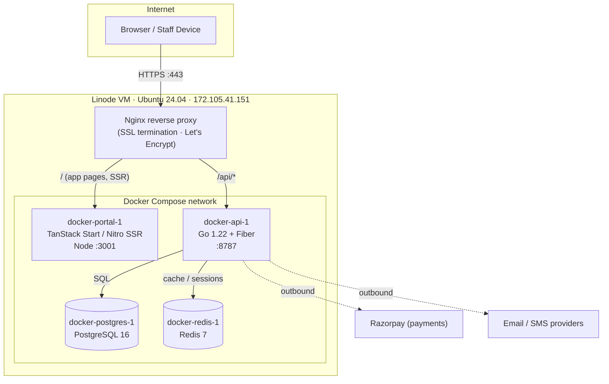
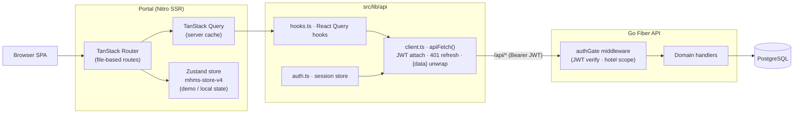
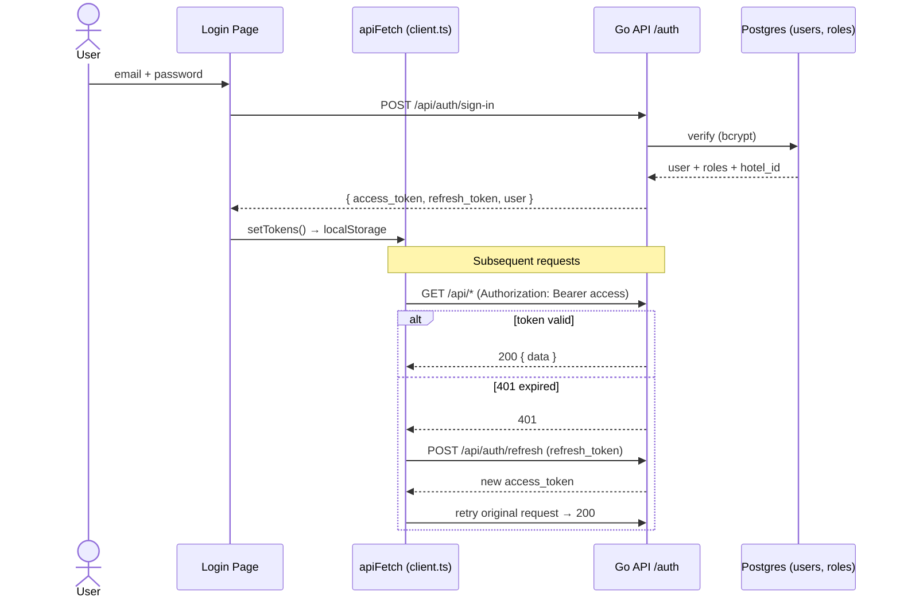
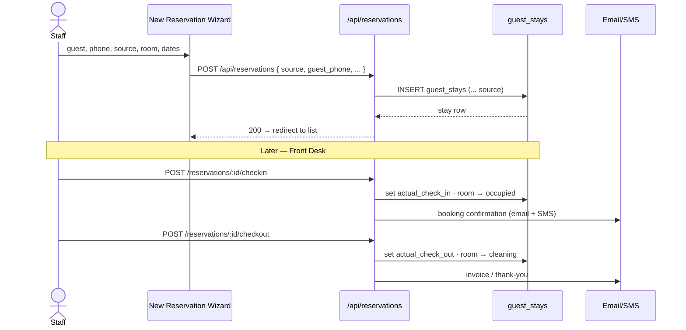
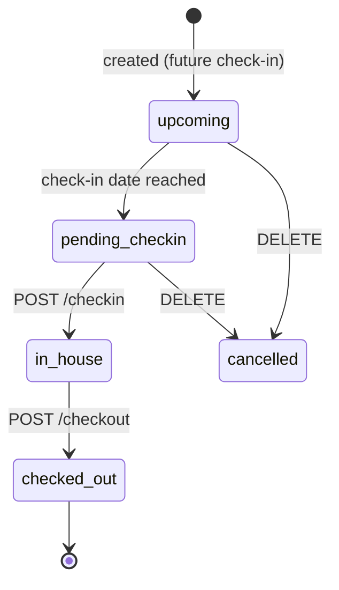
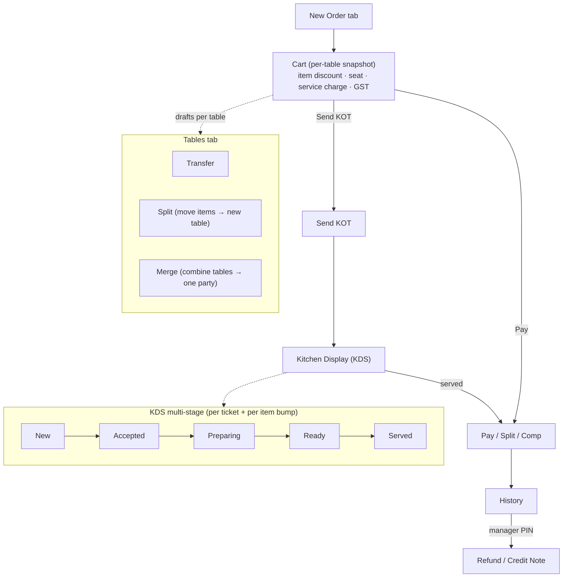
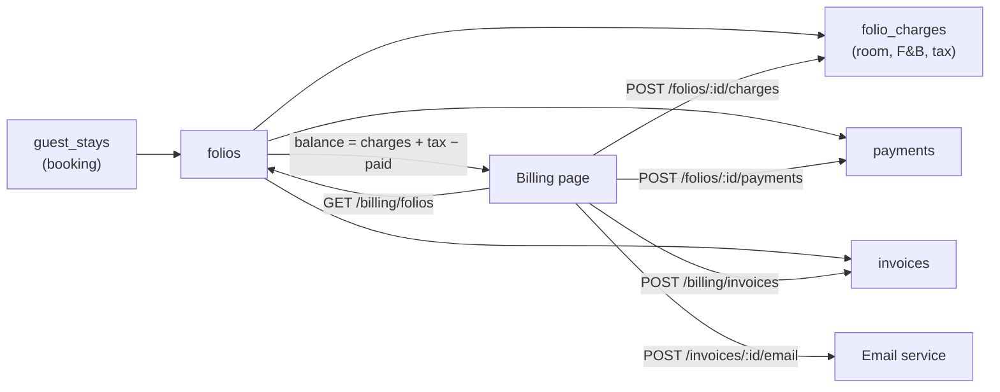
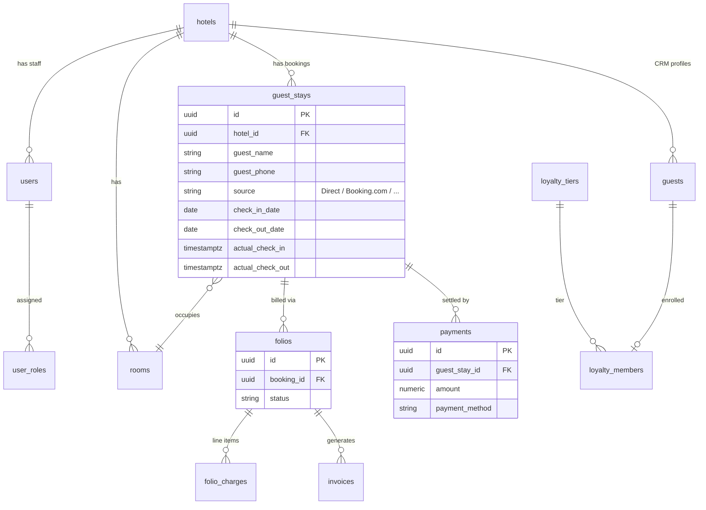
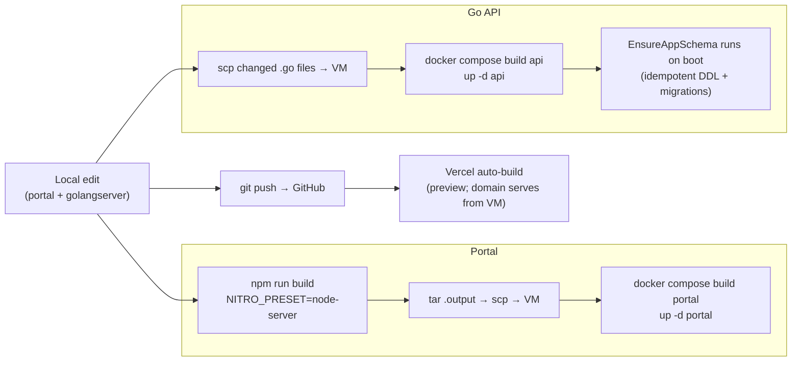

# MHMS — Hotel Harmony Management System: Architecture & Flow

> Master Hotel Management System (v2). Multi-tenant hotel PMS + POS.
> Live at **https://hmsadmin.jazverse.online**
>
> This document maps the **current** system: deployment, request flow, auth,
> which features are wired to the live API vs. the demo store, and the core
> business flows (reservations, POS, billing, night audit).
>
> Diagrams are [Mermaid](https://mermaid.js.org/) — they render automatically on GitHub.

---

## 1. Deployment / Infrastructure

Everything runs as **4 Docker containers** on a single Linode VM (Ubuntu 24.04),
fronted by Nginx with Let's Encrypt SSL.

**Key facts**
| Component | Tech | Port | Notes |
|---|---|---|---|
| Portal | TanStack Start, React 19, Nitro SSR, shadcn/ui, Tailwind v4 | 3001 | Built `NITRO_PRESET=node-server`; `.output/` shipped to VM |
| API | Go 1.22 + Fiber | 8787 | Auto-runs `EnsureAppSchema` + SQL migrations on boot |
| DB | PostgreSQL 16 | — | Multi-tenant: `hotel_id` on all tables |
| Cache | Redis 7 | — | Dashboard stats cache, sessions |
| Proxy | Nginx | 443/80 | Routes `/api/*` → API, everything else → Portal |

---

## 2. Request / Data Flow

The browser talks to **one origin** (`hmsadmin.jazverse.online`). Nginx splits
traffic: page requests go to the SSR portal, `/api/*` goes to the Go API. The
React app calls the API with **relative URLs** (same-origin, no CORS).

**Two data sources, by design**
- **Live API** (`TanStack Query` → `apiFetch`) — real persisted data.
- **Demo store** (`Zustand mhms-store-v4`) — local, in-browser fallback so every
  page renders even when not signed in / backend unreachable. Pages show a
  **"Live data" / "Demo data"** badge.

---

## 3. Authentication Flow

JWT-based. Access token (15 min) + refresh token (7 days) in `localStorage`.
`apiFetch` transparently refreshes once on a `401`.

**Roles** (`user_roles`): `super_admin`, `hotel_admin`, `front_desk`,
`housekeeping`, `accountant`, `fnb`, `guest`, plus a platform `platform_admin`
flag. The Users page maps these to UI labels (Admin / Manager / Front Desk / …).

---

## 4. Feature Map — Pages ↔ API Domains (Live vs. Demo)

24 portal routes. This shows what each page connects to **today**.

```mermaid
flowchart TB
    subgraph LIVE["✅ Wired to live Go API"]
        direction TB
        DASH["Dashboard /"]
        RES["Reservations<br/>(list · new · detail)"]
        FD["Front Desk"]
        CRM["CRM / Guests"]
        HK["Housekeeping"]
        BILL["Billing & Finance"]
        USERS["Users & Roles"]
    end

    subgraph DEMO["🟡 Demo store only (Zustand)"]
        direction TB
        POS["POS & Restaurant"]
        REST["Restaurant ops"]
        MENU["Menu Management"]
        REP["Reports"]
        NA["Night Audit"]
        REV["Revenue"]
        CH["Channel Manager"]
        BE["Booking Engine"]
        INV["Inventory"]
        PROC["Procurement"]
        MNT["Maintenance"]
        PROP["Properties"]
        ADM["Admin"]
    end

    subgraph APIDOMAINS["Go API handler domains"]
        A_AUTH["/auth"]
        A_DASH["/dashboard"]
        A_RES["/reservations"]
        A_ROOM["/rooms"]
        A_CRM["/crm"]
        A_HK["/housekeeping"]
        A_BILL["/billing"]
        A_USERS["/users"]
        A_NA["/night-audit"]
        A_REV["/revenue"]
        A_CH["/channel"]
        A_BOOK["/booking"]
        A_PROC["/procurement"]
        A_ASSET["/asset"]
        A_REP["/reports"]
        A_AI["/ai"]
        A_PAY["/payments (Razorpay)"]
        A_COMM["/communications"]
        A_PLAT["/platform"]
    end

    DASH --> A_DASH
    RES --> A_RES
    RES --> A_ROOM
    FD --> A_RES
    CRM --> A_CRM
    HK --> A_HK
    BILL --> A_BILL
    USERS --> A_USERS
    USERS --> A_AUTH

    %% Demo pages have matching APIs that are NOT yet wired
    NA -. "available, not wired" .-> A_NA
    REP -. "available, not wired" .-> A_REP
    REV -. "available, not wired" .-> A_REV
    CH -. "available, not wired" .-> A_CH
    BE -. "available, not wired" .-> A_BOOK
    PROC -. "available, not wired" .-> A_PROC
    MNT -. "available, not wired" .-> A_ASSET
    POS -. "available, not wired" .-> A_PAY
```

> **Legend:** solid arrow = live integration; dotted arrow = backend endpoint
> exists but the page still reads/writes the demo store. POS, Reports,
> Night-Audit, Revenue, Channel, Booking-Engine, Inventory, Procurement,
> Maintenance, Properties and Admin are demo-only today.

---

## 5. Reservation Lifecycle (live)

The New Reservation wizard now persists to the API, including **phone** and
**booking source** (Direct / Booking.com / Expedia / MakeMyTrip / Goibibo /
Agoda / Airbnb / Walk-in / Phone / Corporate).

Status is **derived** server-side from timestamps:
`upcoming → pending_checkin → in_house → checked_out`.

---

## 6. POS Order Flow (live · Redis-cached)

POS orders are **persisted to the backend** (`pos_orders` table, JSONB line
items) via `/api/pos/orders` when signed in, with a demo-store fallback when
offline. The order list is **cached in Redis** (15s TTL, invalidated on every
write) and polled every 15s for near-real-time KDS / Live Orders. Multi-cart,
KDS stages, table split/merge, refunds and tax depth remain client-side UI on
top of the persisted order.

**POS order state (store):** `Open → Sent → Paid`. KDS stages and refund/credit
records are tracked in component state keyed by order id.

---

## 7. Billing Flow (live)

Payments attach to the **booking** (`guest_stay_id`); when a booking has
multiple folios, completed payments are attributed to the earliest (canonical)
folio to avoid double counting.

---

## 8. Core Data Model (key tables)

Every tenant-scoped table carries `hotel_id`. Default demo hotel:
`The Grand Demo Hotel` (`00000000-0000-0000-0000-000000000001`).

---

## 9. Build & Deploy Pipeline

> Note: `hmsadmin.jazverse.online` DNS points at the **VM** (Docker), not Vercel.
> Vercel builds on push for preview only; production traffic is served by the VM.

---

## 10. Summary — What's Real vs. Demo (today)

| Area | Status |
|---|---|
| Auth, JWT, roles | ✅ Live |
| Dashboard, Reservations, Front Desk, CRM, Housekeeping | ✅ Live |
| Billing (folios/charges/payments/invoices), Users | ✅ Live |
| Booking source (OTA) on reservations | ✅ Live |
| POS orders (`pos_orders`, Redis-cached) | ✅ Live |
| POS KDS stages, split/merge, refunds, tax depth | 🟡 Client-side UI over the persisted order |
| Reports, Night Audit, Revenue, Channel Mgr, Booking Engine | 🟡 Demo — backend endpoints exist, not wired |
| Inventory, Procurement, Maintenance, Properties, Admin | 🟡 Demo |

**Biggest next integration:** post POS F&B + room-charge to guest folios
(closes the POS ↔ Billing loop), and persist KDS stage / refund records.

---
*Generated as a snapshot of the system on this branch. Update alongside feature changes.*
